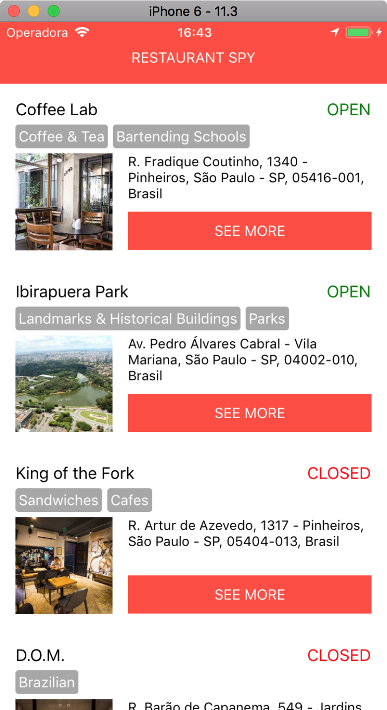

#  Restaurant Spy App

## Description:
* Main goal of the app is to get every information available of a Restaurant by using different APIs (like: Google, Yelp, Foursquare, etc).

* By this time, the app uses User's geolocation to list nearby places from Yelp API. And, after that, it gets more info about each place from Google Places.

* Then, User is able to select a restaurant and check pictures and reviews from both Google Places and Yelp.

## Demo:

GIF: [Gif link](https://www.dropbox.com/s/7aie4cjj448uudz/demo.gif?dl=0)

| Screenshot 1 | Screenshot 2 | Screenshot 3 |
| ------------ | ------------ | ------------ |
|  |  |  |

| Screenshot 4 | Screenshot 5 | Screenshot 6 |
| ------------ | ------------ | ------------ |
|  |  |  |

## Running:
1. Clone repo
2. npm install
3. react-native run-ios or react-native run-android
